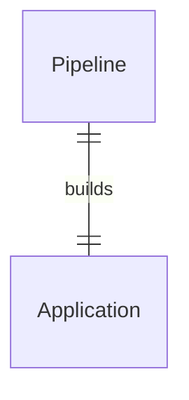
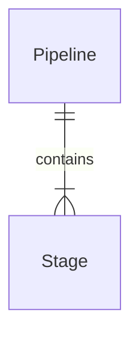
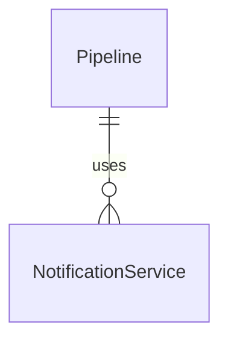
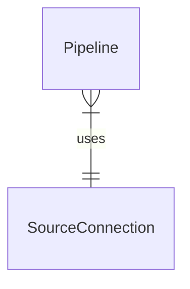
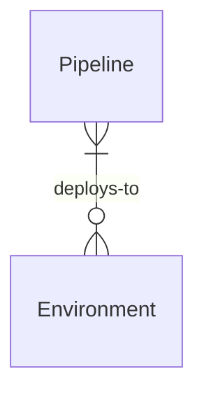
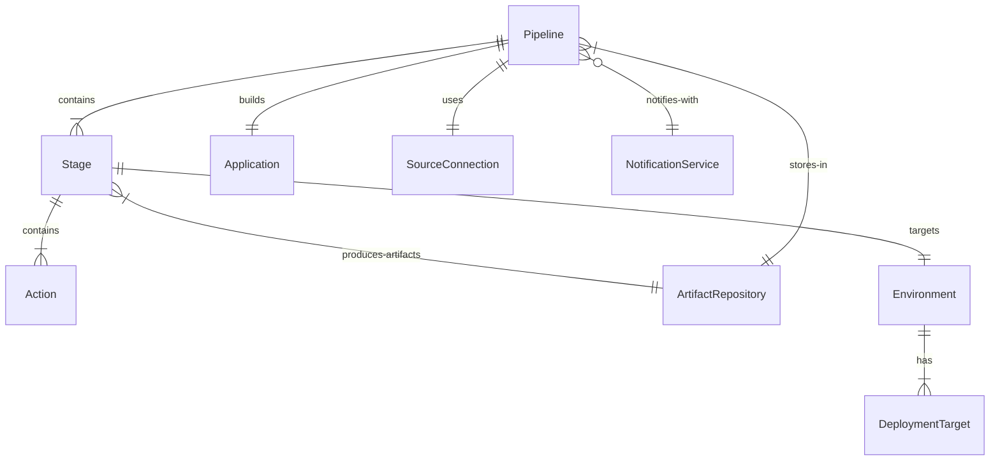
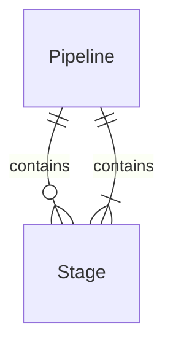
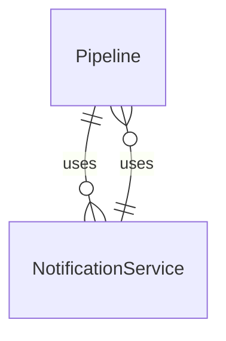
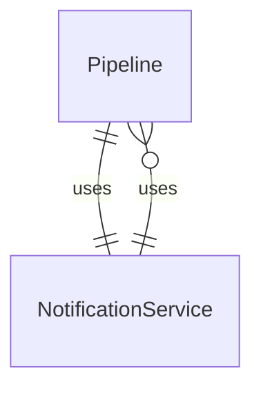

# Mermaid Entity Relationship Diagram Reference

## Overview

Mermaid ER diagrams use specific symbols to represent relationships between entities. Understanding these symbols is crucial for accurate domain modeling.

## Cardinality Symbols

### Left Side of Relationship
| Symbol | Meaning | Description |
|--------|---------|-------------|
| `\|\|` | Exactly One (1) | The entity must exist exactly once |
| `\|{` | One or More (1+) | The entity must exist at least once, can be many |
| `}\|` | Zero or One (0..1) | The entity may or may not exist, but only once if it does |
| `}{` | Zero or More (0+) | The entity may not exist, or can exist multiple times |

### Right Side of Relationship
| Symbol | Meaning | Description |
|--------|---------|-------------|
| `\|\|` | Exactly One (1) | The entity must exist exactly once |
| `{\|` | One or More (1+) | The entity must exist at least once, can be many |
| `\|}` | Zero or One (0..1) | The entity may or may not exist, but only once if it does |
| `}{` | Zero or More (0+) | The entity may not exist, or can exist multiple times |

## Connection Types

| Symbol | Type | Description | Use Case |
|--------|------|-------------|----------|
| `--` | Identifying/Strong | Strong relationship, composition | Parent owns child (Pipeline owns Stages) |
| `..` | Non-identifying/Weak | Weak relationship, association | Entities exist independently |

## Optional/Mandatory Indicators

| Symbol | Meaning | Description |
|--------|---------|-------------|
| `\|` | Mandatory | The relationship must exist |
| `o` | Optional | The relationship may or may not exist |

## Common Relationship Patterns

### One-to-One Relationships

- **Meaning**: One Pipeline builds exactly one Application
- **Use Case**: Each pipeline is dedicated to a single application

### One-to-Many Relationships

- **Meaning**: One Pipeline contains one or more Stages
- **Use Case**: Composition relationship where parent owns children

### Optional One-to-Many

- **Meaning**: One Pipeline optionally uses zero or more NotificationServices
- **Use Case**: Pipeline might not need notifications, or could use multiple services

### Many-to-One

- **Meaning**: Zero or one Pipeline uses exactly one SourceConnection
- **Use Case**: Multiple pipelines could share the same source, or source exists independently

### Many-to-Many

- **Meaning**: Zero or more Pipelines deploy to zero or more Environments
- **Use Case**: Complex relationships where entities can have multiple associations

## Complete Syntax Breakdown

### Format: `[Left Cardinality][Connection][Optional/Mandatory][Right Cardinality]`

Examples:
- `||--|{` = One-to-Many, Strong, Mandatory
- `}o--||` = Many-to-One, Strong, Optional (from left side)
- `||..o{` = One-to-Many, Weak, Optional
- `}{..}{` = Many-to-Many, Weak, Optional

## Domain Modeling Guidelines

### Use Strong Relationships (`--`) When:
- Parent entity "owns" the child entity
- Child cannot exist without parent
- Example: `Pipeline ||--|{ Stage` (Stages belong to Pipeline)

### Use Weak Relationships (`..`) When:
- Entities exist independently
- Relationship is more of an association
- Example: `Pipeline ..||.. User` (Pipeline references User, but User exists independently)

### Use Optional (`o`) When:
- The relationship might not always exist
- Entity can function without the relationship
- Example: `Pipeline ||--o{ Notification` (Pipeline might not send notifications)

### Use Mandatory (`|`) When:
- The relationship must always exist
- Entity cannot function without the relationship
- Example: `Pipeline ||--|{ Stage` (Pipeline must have stages)

## Common CI/CD Domain Examples

## Best Practices

### 1. Start with Core Relationships
- Identify the main entities first
- Define the strongest relationships (composition)
- Add weaker associations later

### 2. Question Each Relationship
- **Cardinality**: How many on each side?
- **Ownership**: Does one entity own the other?
- **Optional**: Can this relationship not exist?
- **Independence**: Can entities exist without this relationship?

### 3. Use Domain Language
- Name relationships with business terms
- Examples: "contains", "builds", "deploys-to", "notifies-with"

### 4. Validate with Business Rules
- Each relationship should reflect a business rule
- If you can't explain the relationship in business terms, reconsider it

## Common Mistakes to Avoid

### ❌ Wrong Cardinality

### ❌ Wrong Relationship Direction

### ❌ Missing Optional Indicators

## Reference Quick Card

| Pattern | Syntax | Meaning |
|---------|--------|---------|
| One-to-One Mandatory | `\|\|--\|\|` | Each side must have exactly one |
| One-to-Many Composition | `\|\|--\|{` | Parent owns one or more children |
| One-to-Many Optional | `\|\|--o{` | Parent may have zero or more children |
| Many-to-One Shared | `}\|--\|\|` | Many entities share one resource |
| Many-to-Many | `}{..}{` | Complex associations between entities |

Remember: The goal is to accurately represent your business domain relationships, not to create complex diagrams. Start simple and add complexity only when it reflects real business rules.
