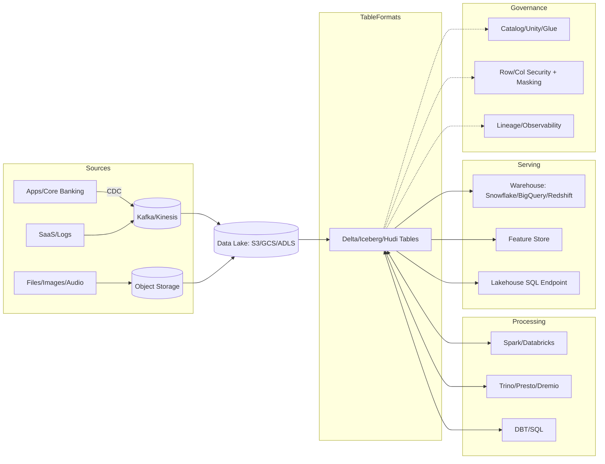

```mermaid
---
config:
  layout: dagre
---
flowchart LR
 subgraph Sources["Sources"]
        K[("Kafka/Kinesis")]
        A["Apps/Core Banking"]
        B["SaaS/Logs"]
        O[("Object Storage")]
        C["Files/Images/Audio"]
  end
 subgraph TableFormats["TableFormats"]
        T1["Delta/Iceberg/Hudi Tables"]
  end
 subgraph Processing["Processing"]
        SP1["Spark/Databricks"]
        SP2["Trino/Presto/Dremio"]
        SP3["DBT/SQL"]
  end
 subgraph Serving["Serving"]
        W1["Warehouse: Snowflake/BigQuery/Redshift"]
        F["Feature Store"]
        API["Lakehouse SQL Endpoint"]
  end
 subgraph Governance["Governance"]
        Cat["Catalog/Unity/Glue"]
        Sec["Row/Col Security + Masking"]
        Lin["Lineage/Observability"]
  end
    A -- CDC --> K
    B --> K
    C --> O
    K --> S3[("Data Lake: S3/GCS/ADLS")]
    O --> S3
    S3 --> T1
    T1 <--> SP1 & SP2 & SP3
    T1 --> W1 & F & API
    T1 -.-> Cat & Sec & Lin

```
