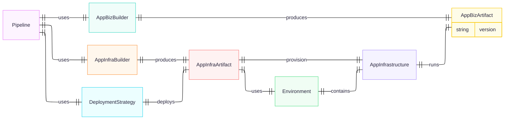

# Entities

## core entities for my CI/CD domain

1. ScourceConnection
1. Stage
    1. install dependencies
    1. build
    1. run unit tests phase
    1. release
1. Pipeline
1. NotificationService
1. Application
1. Environment
1. DeploymentTarget
1. ArtifactRepository

### Source Connection
Responsible to handle credentials, renew credentials if they expire, handle different sourceTypes (github, gitlab, s3)

### Stage
A Stage is responsible to run the arbitrary commands required to install dependencies, build, run unit tests and release.

A Stage can be in the following states: in-progress, failed, succeeded, paused.

A Stage can require Manual-Humman Approval.

### Notificator
Responsible to communicate via given communication channels on failure or success and transition from one stage to the next.

### Pipeline
Responsible orchestrate the execution of the PipelineStages, if a given PipelineStage fails, the pipeline will be responsible of deciding if the whole pipeline stops there, use the NotificationService or continue to the next PipelinePhase.

Pipeline also responsible to define the trigger event, either a push to a given branch on git repository or event in an s3 bucket. Like pipeline.triggerOn(PipelineTriggerProps)

The pipeline can be in the following states: in-progress, failed, succeeded, paused.

## Business Rules Documentation

### 1. Deployment Orchestration Rules

  | Rule ID | Description | Entities Involved | Validation Point |
  |---------|-------------|-------------------|------------------|
  | BR-001 | AppInfrastructure must be provisioned before AppBizArtifact deployment | AppInfrastructure, AppBizArtifact, Pipeline | Pipeline.execute() |
  | BR-002 | Infrastructure provisioning failure stops pipeline | AppInfraArtifact, Pipeline | AppInfraArtifact.provision() |

### 2. Environment Rules

  | Rule ID | Description | Entities Involved | Validation Point |
  |---------|-------------|-------------------|------------------|
  | BR-004 | Each Environment contains exactly one AppInfrastructure instance | Environment, AppInfrastructure | Environment.setInfrastructure() |
  | BR-005 | Environment-specific configuration must be applied | Environment, AppInfraArtifact | AppInfraArtifact.provision() |

### 3. Version Compatibility Rules

  | Rule ID | Description | Entities Involved | Validation Point |
  |---------|-------------|-------------------|------------------|
  | BR-007 | AppBizArtifact version must be compatible with AppInfrastructure | AppBizArtifact, AppInfrastructure | Pipeline.validateCompatibility() |
  | BR-008 | Version compatibility check before deployment | AppBizBuilder, AppInfraBuilder | Pipeline.execute() |

## Business Rule Validation Tests

  ```typescript
  describe('Business Rules Validation', () => {
    describe('BR-001: Infrastructure before Application', () => {
      it('should provision infrastructure before deploying application', () => {
        // Test implementation
      });
    });

    describe('BR-004: One Infrastructure per Environment', () => {
      it('should reject multiple infrastructure instances in same environment', () => {
        // Test implementation
      });
    });
  });
  ```
